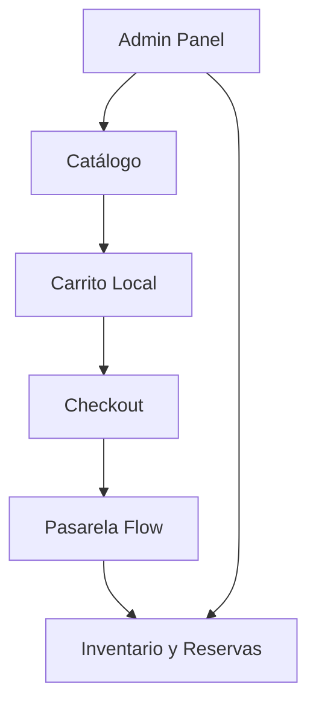

# 00 - Resumen Ejecutivo del Sistema

Este documento proporciona una visión general de alto nivel del sistema e-commerce Orbynex Digital, detallando sus objetivos, alcance actual y las fronteras funcionales de sus dominios clave.

---

## 1. Objetivo del Sistema
El propósito principal del e-commerce de **Orbynex Digital** es proporcionar una plataforma de venta en línea ágil, segura y automatizada para productos y servicios. El sistema minimiza las tareas operativas manuales y optimiza los flujos de negocio mediante:
*   Un catálogo web de alto rendimiento y diseño premium.
*   Gestión automatizada de inventario en tiempo real con control de reservas temporales.
*   Integración transaccional robusta con la pasarela de pagos **Flow.cl** mediante webhooks e idempotencia de estados.
*   Un panel de administración simplificado para control de catálogo y órdenes.

---

## 2. Alcance Actual: Qué Hace y Qué No Hace

### Qué SÍ hace el sistema:
*   **Visualización en tiempo real**: Renderiza productos y servicios filtrando dinámicamente aquellos marcados como inactivos o configurados para ocultarse por falta de stock.
*   **Reserva temporal de stock (10 minutos)**: Reserva el stock físico de un producto de forma atómica en base de datos al momento de iniciar la redirección al portal de pago de Flow.
*   **Liberación por inactividad / vencimiento**: Libera de forma automática e integrada (a través de un webhook o cron cada 1 minuto) aquellas reservas de stock asociadas a compras no concretadas.
*   **Gestión de conflictos de inventario**: Mitiga el sobre-stock y las compras fantasmas. Si un usuario paga por una orden cuya reserva ya venció, el sistema detecta el desfase de tiempo y previene decrementos incorrectos de stock, asignando la orden a revisión manual (`requires_manual_review`) o conflicto de stock (`stock_conflict`).
*   **Soporte de Backorder**: Permite comprar ciertos productos sin stock físico (bajo demanda) si la bandera `allow_backorder` está habilitada.
*   **Desactivación de inventario**: Admite la venta continua de productos no físicos (servicios/consultorías) que no requieren control de stock mediante la bandera `track_inventory = false`.
*   **Enlaces de pago externos alternativos**: Permite omitir el carrito local y redirigir directamente a enlaces de pago personalizados en productos específicos.
*   **Checkout simplificado en WhatsApp**: Soporta un flujo de compra alternativo enviando el desglose del pedido mediante un mensaje pre-formateado a WhatsApp.

### Qué NO hace el sistema (Fuera de Alcance):
*   **Gestión multi-moneda activa**: La pasarela de pagos Flow está restringida estrictamente a transacciones en pesos chilenos (`CLP`).
*   **Integración física de despachos**: No se calculan tarifas de envío en tiempo real con operadores logísticos (el costo de despacho está fijado en `0` en base de datos).
*   **Pasarelas internacionales de pago**: No soporta cobros mediante Stripe, PayPal u otras redes en el flujo principal de checkout (se restringe a Flow.cl y links externos).
*   **Facturación electrónica automática**: El sistema no emite boletas o facturas ante el Servicio de Impuestos Internos (SII) de forma automatizada (debe gestionarse externamente).

---

## 3. Dominios del Sistema

El e-commerce está estructurado en torno a seis dominios principales interconectados:

### 3.1. Catálogo
Administra la visualización del listado y detalles del producto. Controla las variantes de imágenes optimizadas (miniatura, tarjeta y detalle) y calcula la disponibilidad visual del producto en el frontend resolviendo la combinación de stock físico, reservas activas, y reglas de visibilidad.

### 3.2. Carrito Local
Store persistente en el navegador del cliente (`localStorage`) que agrupa los productos seleccionados, calcula subtotales en tiempo real y alerta activamente al usuario si existen variaciones en el stock disponible de sus productos antes de ir al checkout.

### 3.3. Checkout
Formulario de captura de datos del cliente (nombre, correo, teléfono y comentario) y punto de validación definitivo. Coordina con el backend la pre-creación de la orden en Supabase, el aseguramiento de la reserva del stock en base de datos, y el inicio del túnel de pago oficial de Flow.

### 3.4. Pagos (Flow.cl)
Orquesta el túnel transaccional fuera de la aplicación. Gestiona la generación de tokens de pago únicos, la redirección segura del cliente, el procesamiento de webhooks de confirmación del banco (sincrónicos y asincrónicos), y el mapeo de estados transaccionales al modelo local.

### 3.5. Inventario y Reservas
Control centralizado en la base de datos (Supabase) mediante SQL RPCs de alta confianza y bloqueos atómicos (`FOR UPDATE`). Su misión es mantener el balance de stock físico versus stock vendible (stock vendible = stock físico - reservas activas).

### 3.6. Administración (Admin)
Sección privada y protegida mediante RLS y roles (`user_roles`) en Supabase. Permite crear, editar y eliminar productos, actualizar niveles de inventario físico, habilitar/deshabilitar reservas, y subir imágenes de catálogo mediante un proceso de optimización del lado del cliente.
