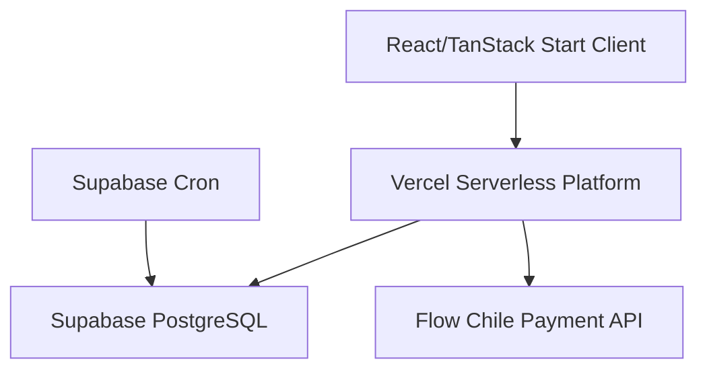

# 01 - Stack Tecnológico y Estructura de Carpetas

Este documento detalla los frameworks, librerías, servicios de infraestructura y la estructura física de directorios que componen la plataforma e-commerce de Orbynex Digital.

---

## 1. Stack Tecnológico Core

La aplicación está construida sobre un stack moderno y eficiente optimizado para rendimiento, escalabilidad y despliegue serverless:

| Capa | Tecnología | Propósito |
| :--- | :--- | :--- |
| **Frontend Framework** | React v19 | Librería para la interfaz de usuario. |
| **Routing / SSR** | TanStack Start + Router | Framework moderno de enrutamiento y renderizado híbrido. |
| **Build Tool / Bundler** | Vite v8 | Entorno de desarrollo ultra-rápido y empaquetador de producción. |
| **Runtime Serverless** | Nitro (dentro de TanStack Start) | Motor de servidor portable de alto rendimiento para API endpoints. |
| **Base de Datos / Backend** | Supabase | PostgreSQL gestionado con autenticación, RLS y almacenamiento. |
| **Pasarela de Pagos** | Flow.cl | Procesamiento local chileno de pagos online (Webpay, Khipu, etc.). |
| **Plataforma Cloud** | Vercel + Supabase | Vercel aloja la aplicación y sus funciones; Supabase ejecuta las tareas programadas dentro de PostgreSQL. |

---

## 2. Librerías y Dependencias Principales

### Frontend & UI
*   **Tailwind CSS v4**: Framework de utilidades CSS de última generación.
*   **Radix UI**: Primitivas de componentes accesibles y sin estilos (Accordion, Dialog, Drawer, Dropdown, Select, Sheet).
*   **Lucide React**: Biblioteca de iconos vectoriales modernos.
*   **Sonner**: Componente premium para notificaciones flotantes (toasts).
*   **React Hook Form + Zod**: Manejo y validación robusta de formularios y esquemas en cliente.
*   **Embla Carousel React**: Soporte para carruseles de imágenes y productos interactivos.

### Manejo de Estado y Datos
*   **TanStack React Query (v5)**: Cliente para sincronización de estado, caché de red y refetching inteligente (especialmente para la verificación de stock en checkout).
*   **React Context (CartStore)**: Manejo del estado global del carrito con sincronización automática en `localStorage` (`shop_cart_v1`).

---

## 3. Servicios Externos e Infraestructura



### 3.1. Supabase (BaaS)
*   **Base de Datos**: PostgreSQL v15+.
*   **Autenticación**: Proveedor incorporado para control de accesos de clientes y administradores.
*   **RLS (Row Level Security)**: Restricción nativa a nivel de fila que previene lecturas y escrituras no autorizadas directamente desde el cliente.
*   **Supabase Storage**: Bucket público `product-images` para almacenar las variantes optimizadas de imágenes de productos.
*   **Supabase Cron (`pg_cron`)**: La migración del repositorio programa
    `public.expire_stock_reservations()` cada 10 minutos, sin depender de GitHub Actions ni de
    solicitudes HTTP externas. Su estado remoto se verifica durante el despliegue.

### 3.2. Flow Chile
*   Pasarela de pago online de bajo costo para transferencias y tarjetas bancarias en Chile.
*   Opera a través de un esquema de firmas seguras mediante **HMAC-SHA256** utilizando `flowApiKey` y `flowSecretKey`.

### 3.3. Vercel
*   **Vercel Functions**: Aloja los endpoints serverless ubicados bajo la carpeta `/api` para procesamiento seguro del lado del servidor.
*   **Tareas programadas**: No se usa Vercel Cron para la expiración de reservas; esta responsabilidad pertenece a Supabase Cron.

---

## 4. Estructura de Directorios del Proyecto

La organización del código fuente en el repositorio sigue las convenciones del ecosistema React/Vite/TanStack Start:

```
tienda-orbynexdigital/
├── api/                             # Endpoints Serverless (Vercel Functions)
│   ├── account/                     # Operaciones autenticadas de cuenta
│   ├── admin/                       # Operaciones administrativas server-only
│   ├── flow/                        # Integración con la pasarela Flow
│   │   ├── confirm.ts               # Webhook / confirmación de pagos
│   │   ├── create-payment.ts        # Inicialización de órdenes y cobros
│   │   └── order-status.ts          # Consulta de estado de orden para clientes
│   ├── products/
│   │   └── availability.ts          # Consulta dinámica de stock vendible
│   └── stock/
│       └── expire-reservations.ts   # Respaldo HTTP manual para limpiar reservas
├── docs/                            # Documentación técnica general y activos
│   ├── assets/                      # Diagramas e imágenes de documentación
│   └── technical/                   # Guías técnicas modulares
├── public/                          # Activos públicos estáticos del frontend
├── src/                             # Código fuente de la aplicación
│   ├── components/                  # Componentes reutilizables
│   │   ├── admin/                   # Componentes del panel administrativo
│   │   │   └── ProductForm.tsx      # Formulario de productos con optimización de img
│   │   ├── cart/                    # Componentes del carrito
│   │   │   └── CartDrawer.tsx       # Drawer lateral del carrito
│   │   ├── layout/                  # Navbar, Footer y contenedores de diseño
│   │   ├── product/                 # Tarjetas e imágenes de productos
│   │   └── ui/                      # Componentes base (Radix/Shadcn)
│   ├── config/                      # Configuraciones globales (Marca y e-commerce)
│   ├── integrations/                # Conectores y clientes de SDKs
│   │   └── supabase/                # Cliente y tipos autogenerados de Supabase
│   ├── routes/                      # Rutas de la aplicación (TanStack Router)
│   │   ├── _authenticated/          # Rutas protegidas (Panel Admin)
│   │   ├── carrito.tsx              # Vista extendida del carrito
│   │   ├── checkout.tsx             # Formulario de compra
│   │   ├── checkout_.resultado.tsx  # Landing de confirmación/error de pago
│   │   ├── index.tsx                # Home / Catálogo principal
│   │   └── producto.$slug.tsx       # Ficha de detalle de producto
│   ├── server/                      # Lógica de utilidad para endpoints serverless
│   │   └── flow/                    # Utilidades de firma, HTTP y conexión admin
│   ├── services/                    # Servicios de API de datos para el cliente
│   │   ├── products.service.ts      # Fetch de productos y disponibilidad
│   │   └── storage.service.ts       # Procesamiento y subida de imágenes
│   ├── store/                       # Manejadores de estado (CartStore)
│   ├── types/                       # Definiciones de TypeScript
│   └── utils/                       # Funciones utilitarias (Inventario, moneda)
├── supabase/                        # Migraciones SQL y scripts locales
│   └── migrations/                  # Archivos de migración de base de datos
├── package.json                     # Archivo de configuración NPM y dependencias
├── vercel.json                      # Configuración de despliegue en Vercel (sin crons)
└── vite.config.ts                   # Configuración del empaquetador Vite
```
