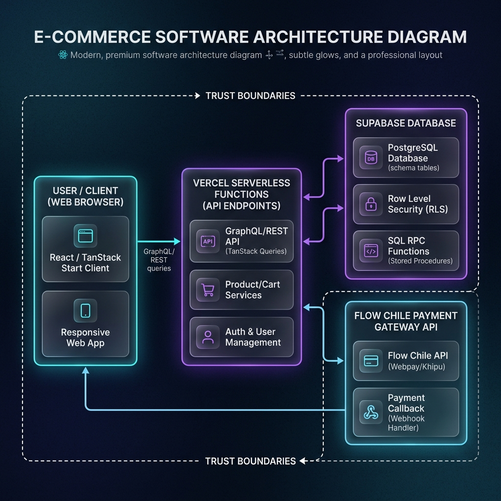
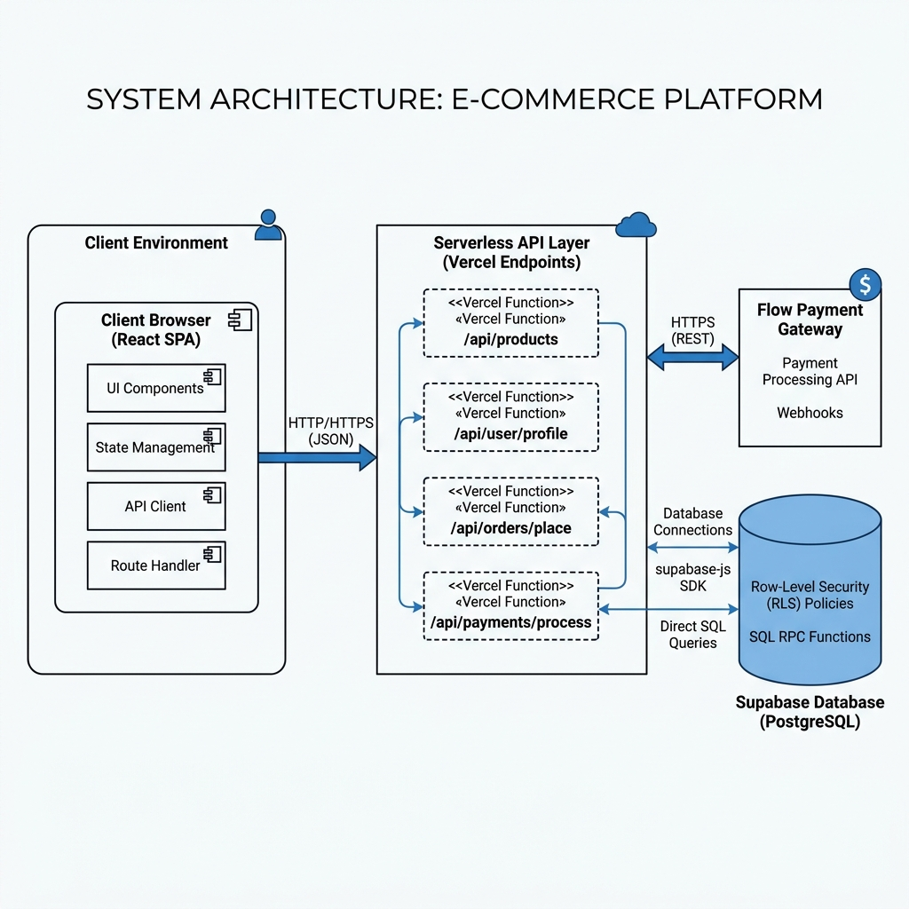

# 02 - Arquitectura del Sistema

Este documento describe la arquitectura técnica de la plataforma, detallando el flujo de datos, los límites de seguridad y la separación de responsabilidades entre el cliente frontend, la API serverless y la base de datos Supabase.

---

## 1. Diagrama de Arquitectura

El siguiente diagrama ilustra la arquitectura lógica y los componentes involucrados en las interacciones cotidianas de compra y administración:

#### Opción A: Vista Premium Conceptual


#### Opción B: Vista UML Formal de Componentes



### Diagrama de Flujo en Mermaid

```mermaid
graph LR
    subgraph Cliente (Navegador)
        SPA[React SPA]
        Store[Cart Store]
    end

    subgraph Serverless (Vercel)
        API_CP[api/flow/create-payment]
        API_CF[api/flow/confirm]
        API_AV[api/products/availability]
        API_EX[api/stock/expire-reservations: respaldo manual]
    end

    subgraph Backend (Supabase)
        DB[(PostgreSQL)]
        RLS[Row Level Security]
        RPC_CR[RPC: create_order_with_stock_reservation]
        RPC_CO[RPC: confirm_order_payment_and_capture_stock]
        RPC_EX[RPC: expire_stock_reservations]
        CRON[Supabase Cron: cada 10 minutos]
        Storage[Storage: product-images]
    end

    subgraph Pasarela (Flow.cl)
        FlowAPI[API de Flow]
    end

    SPA -->|1. Valida stock| API_AV
    SPA -->|2. Inicia compra| API_CP
    API_CP -->|3. Crea orden y bloquea stock| RPC_CR
    RPC_CR -->|4. Escribe orden| DB
    API_CP -->|5. Crea pago| FlowAPI
    FlowAPI -->|6. Token y URL| API_CP
    API_CP -->|7. URL de redirección| SPA
    FlowAPI -->|8. Webhook de confirmación| API_CF
    API_CF -->|9. Obtiene estado oficial| FlowAPI
    API_CF -->|10. Captura inventario| RPC_CO
    RPC_CO -->|11. Reduce stock físico| DB
    CRON -->|12. Limpieza programada| RPC_EX
    API_EX -.->|Respaldo manual| RPC_EX
```

---

## 2. Separación de Responsabilidades

El sistema sigue una arquitectura desacoplada donde el servidor web actúa exclusivamente como una API de transporte ligero y la base de datos se encarga de la consistencia lógica.

### 2.1. Cliente (Frontend)
*   **Responsabilidades**: Renderizado de la UI, control del estado del carrito, validación básica de entrada de datos, optimización y redimensionamiento de imágenes de catálogo (miniatura, tarjeta, detalle) antes de la subida para ahorrar ancho de banda y almacenamiento.
*   **Seguridad**: Accede a Supabase usando llaves públicas anonimizadas (`SUPABASE_PUBLISHABLE_KEY`). Todas las consultas directas de lectura del cliente a las tablas están restringidas por **RLS (Row Level Security)**.

### 2.2. API Serverless (Vercel Functions)
*   **Responsabilidades**: Actuar como puente seguro entre el cliente, Flow y Supabase Admin. Realiza la firma criptográfica de parámetros Flow en el servidor, procesa webhooks y conserva un endpoint manual de respaldo para la limpieza de reservas.
*   **Seguridad**: Ejecuta bajo un ambiente de servidor aislado. Posee acceso exclusivo a secretos sensibles (`FLOW_SECRET_KEY`, `SUPABASE_SERVICE_ROLE_KEY`). El endpoint manual de respaldo requiere además `CRON_SECRET`.

### 2.3. Base de Datos (Supabase / PostgreSQL)
*   **Responsabilidades**: Almacenamiento persistente, resguardo de imágenes mediante buckets, aplicación de políticas RLS para lectura/escritura, ejecución transaccional a nivel SQL y programación de la limpieza de reservas con Supabase Cron.
*   **Seguridad**: El acceso privilegido de escritura (creación de órdenes, manipulación de stock) se encapsula de forma estricta en **RPCs (Remote Procedure Calls)**. Estas funciones están configuradas con `SECURITY DEFINER` y tienen todos los permisos de ejecución revocados para roles públicos, ejecutándose exclusivamente mediante clientes instanciados con la `service_role_key` de Supabase.

La migración define el job de Cron; `docs/PROJECT_STATE.md` distingue esa configuración
versionada de su aplicación y ejecución en un entorno remoto.

---

## 3. Límites de Confianza (Trust Boundaries)

Para asegurar la integridad de la base de datos y prevenir vulnerabilidades lógicas como el robo de stock o manipulación de precios:

*   **Frontera Cliente - Servidor**: El frontend **nunca** calcula precios de órdenes, montos finales, ni actualiza stock de forma directa en las tablas de Supabase. El cliente envía únicamente IDs de productos y cantidades al endpoint `api/flow/create-payment`.
*   **Validación del Servidor**: Los endpoints serverless consultan directamente el precio y stock oficial desde la base de datos y recalculan los montos antes de llamar a Flow.
*   **Aislamiento de la Pasarela**: El webhook de confirmación (`api/flow/confirm`) **nunca** confía en los parámetros recibidos en el payload HTTP. Al recibir la notificación, la API de Vercel realiza una llamada GET a Flow utilizando el token seguro para obtener el estado oficial verificado directamente desde la pasarela, evitando ataques de inyección de parámetros.
*   **Restricción del Service Role**: La `supabaseServiceRoleKey` es una llave maestra que puede bypassear las RLS. Su uso está estrictamente prohibido en código que corra en el cliente final (`src/`). Sólo debe instanciarse en la API del servidor (`src/server/` o `/api`).
*   **Políticas de RLS**: Las tablas de órdenes (`orders`), items (`order_items`) y reservas (`stock_reservations`) tienen sus permisos de inserción y modificación bloqueados al público. Un usuario autenticado común solo puede leer sus propias órdenes creadas bajo su UID.
