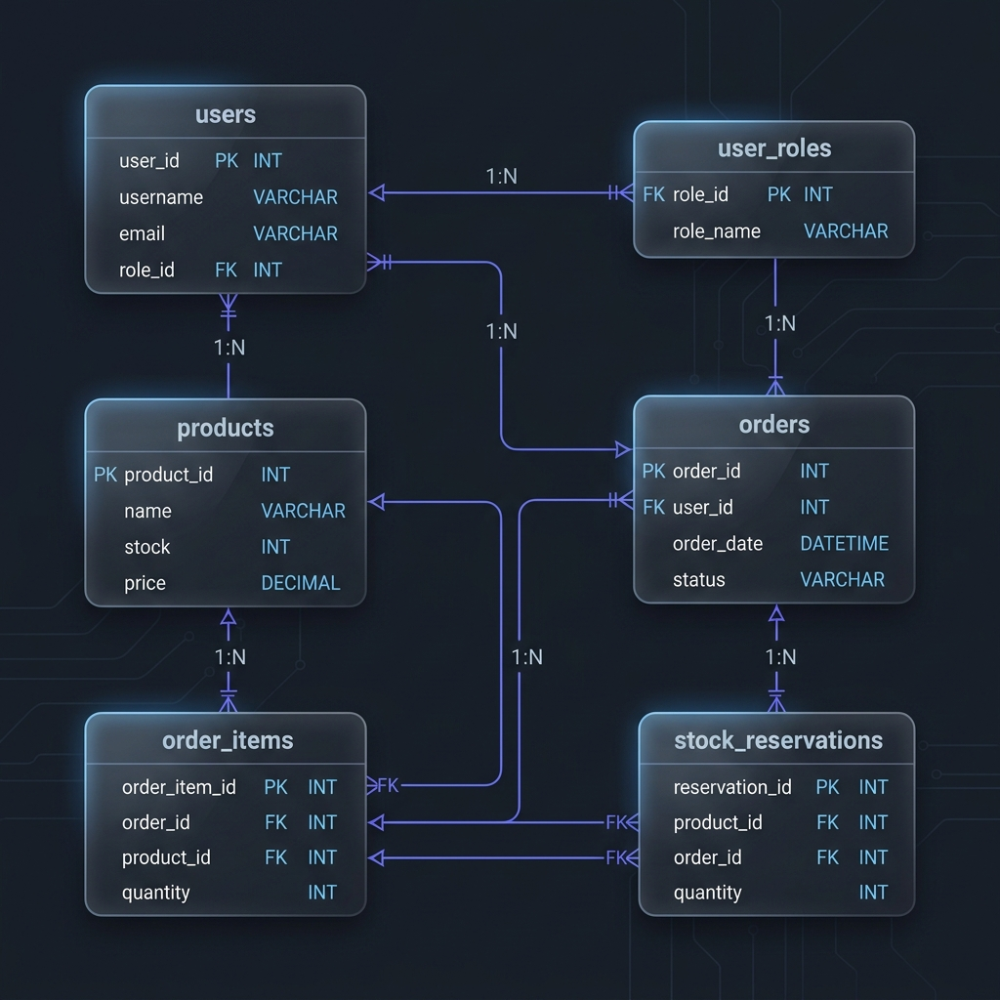
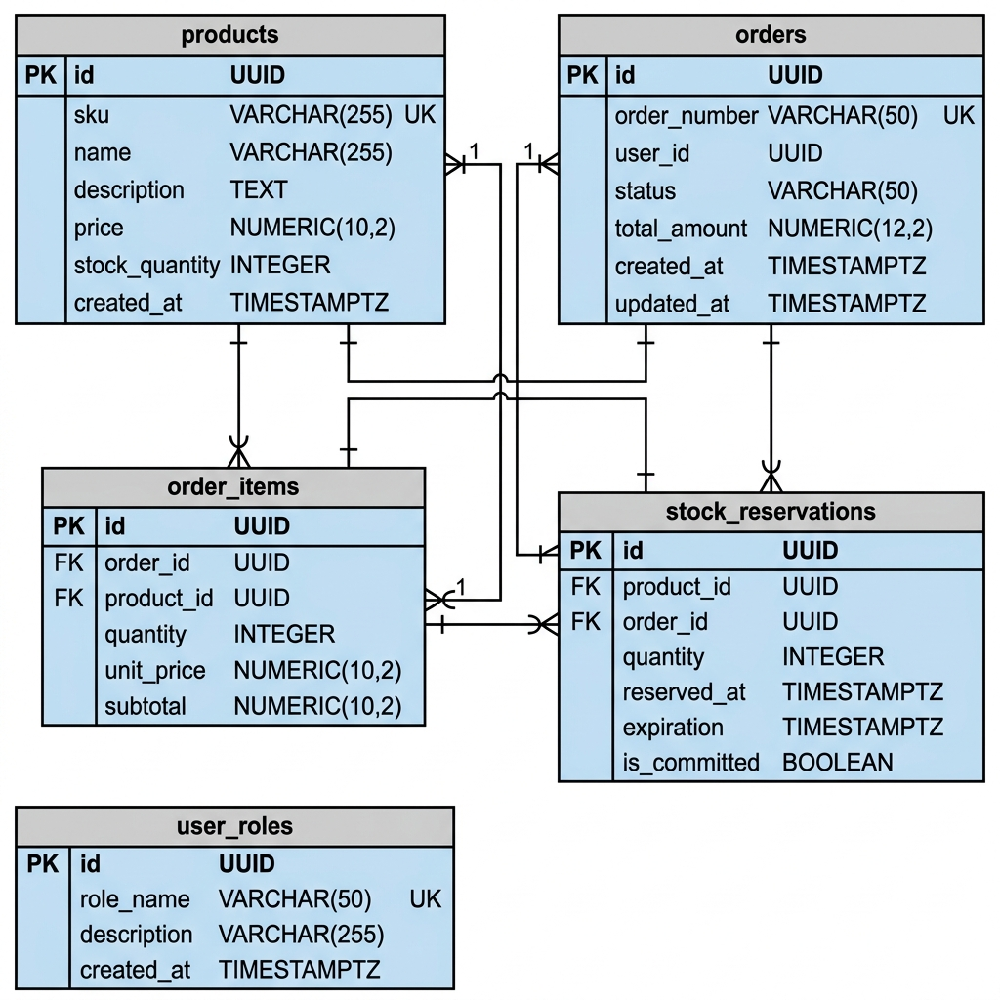
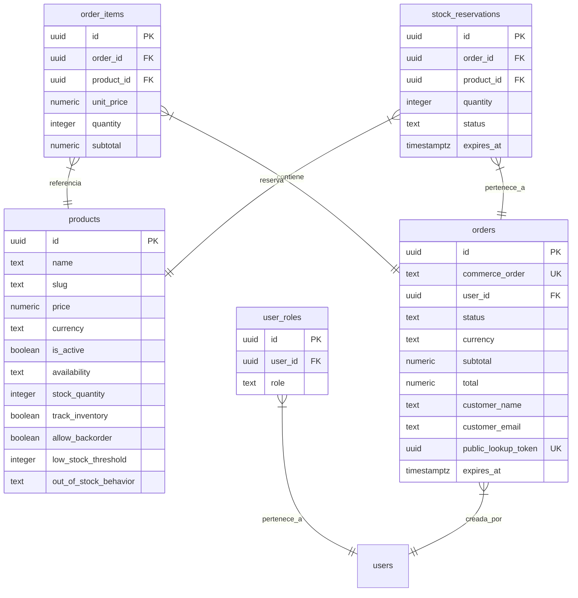

# 03 - Modelo de Dominio y Base de Datos

Este documento describe la estructura lógica del almacenamiento, los campos clave, relaciones, estados posibles y las reglas de negocio que gobiernan a cada entidad del e-commerce Orbynex.

---

## 1. Diagrama del Modelo Entidad-Relación (ERD)

El diseño de datos centraliza la integridad transaccional y las reglas de stock en Supabase:

#### Opción A: Vista Premium Conceptual

#### Opción B: Vista UML ERD Formal (Tipos de datos y constraints)

### Estructura de Relaciones (Mermaid)

---

## 2. Entidades del Sistema

### 2.1. Products (`public.products`)
Representa los ítems que se pueden exhibir y vender en el catálogo.

*   **Campos Clave**:
    *   `price`: Precio del producto. En pesos chilenos (`CLP`), siempre debe redondearse sin decimales al procesar pagos en Flow.
    *   `stock_quantity`: Inventario físico real en bodega (entero >= 0).
    *   `track_inventory`: Si es `true`, el sistema valida el inventario físico y las reservas antes de vender. Si es `false` (servicios), el producto es infinito y comprable siempre.
    *   `allow_backorder`: Si es `true`, permite comprar el producto aunque no haya stock disponible en bodega (venta bajo demanda/reserva diferida).
    *   `out_of_stock_behavior`: Puede ser `show_sold_out` (muestra etiqueta Agotado en la web) o `hide_product` (remueve el producto del catálogo en caliente).
    *   `payment_url` / `payment_button_label`: Link opcional de cobro externo directo.

### 2.2. User Roles (`public.user_roles`)
Define la autorización administrativa de los usuarios autenticados.

*   **Campos Clave**:
    *   `user_id`: Referencia a la tabla interna de usuarios de Supabase (`auth.users`).
    *   `role`: Enumeración (`app_role`) con valores: `admin` o `user`.
*   **Regla de Negocio**: RLS restringe lecturas a usuarios sobre sus propios roles. El rol de administrador otorga permisos bypass RLS en la tabla de productos.

### 2.3. Orders (`public.orders`)
Almacena el estado maestro de un intento de compra o transacción.

*   **Campos Clave**:
    *   `commerce_order`: Identificador alfanumérico único e irrepetible para la pasarela Flow (ej. `ORD-1783455...`).
    *   `status`: Estado de la orden.
    *   `public_lookup_token`: Token UUID único autogenerado en la inserción. Sirve para que el cliente final acceda a `/checkout/resultado?commerceOrder=X&publicLookupToken=Y` para consultar el estado del pago de forma segura sin autenticación.
    *   `expires_at`: Fecha y hora límite en que la reserva de stock asociada a esta orden sigue vigente.

#### Estados de la Orden (`orders.status`):
*   `pending`: Orden creada. Aún no se ha iniciado la redirección a Flow.
*   `stock_reserved`: Stock físico bloqueado temporalmente por una ventana de reserva activa.
*   `redirected`: El usuario fue enviado a la pasarela Flow para pagar.
*   `paid`: Transacción confirmada y validada en el servidor. Stock restado definitivamente.
*   `failed`: El pago fue rechazado por Flow o el banco.
*   `cancelled`: El cliente abortó explícitamente el pago en el portal de Flow.
*   `expired`: El token de pago de Flow venció sin acción del usuario.
*   `reservation_expired`: La ventana de reserva de stock de 10 minutos venció en base de datos antes de que se recibiera la confirmación de pago de Flow.
*   `stock_conflict`: El pago fue recibido pero no queda stock físico suficiente para sustentar la orden (ocurre por decrementos manuales). Requiere intervención del administrador.
*   `requires_manual_review`: El pago se recibió pero la reserva del stock ya había vencido, por lo que el stock no fue decrementado para evitar errores. Requiere revisión manual.

### 2.4. Order Items (`public.order_items`)
Desglose detallado de los productos y precios al momento de la compra.

*   **Campos Clave**:
    *   `unit_price`: Captura histórica del precio del producto al momento de crear la orden. Previene que actualizaciones posteriores de precio en catálogo afecten transacciones anteriores.
    *   `subtotal`: Restricción a nivel de base de datos que obliga a que `subtotal = unit_price * quantity`.

### 2.5. Stock Reservations (`public.stock_reservations`)
Mapea el bloqueo temporal de inventario físico mientras se completa una transacción en la pasarela.

*   **Campos Clave**:
    *   `quantity`: Cantidad reservada.
    *   `expires_at`: Límite temporal de vigencia de la reserva.
    *   `status`: Estado de la reserva.

#### Estados de la Reserva (`stock_reservations.status`):
*   `active`: Reserva vigente. Afecta directamente al cálculo del stock vendible en catálogo.
*   `confirmed`: El pago fue confirmado. La reserva se consumió y el stock físico ya fue descontado.
*   `released`: La compra falló, se canceló o actualizó, y el stock fue devuelto al catálogo.
*   `expired`: Pasaron los 10 minutos de la ventana transaccional sin confirmación y la reserva fue desactivada por el cron.

### 2.6. Storage Product Images (`product-images` bucket)
Estructura física de almacenamiento para los archivos multimedia de catálogo.
*   **Path**: `products/YYYY/MM/UUID-[thumb|card|detail].webp`.
*   **Regla**: Solo administradores pueden escribir en este bucket. Todo archivo debe subirse optimizado bajo formato WebP.
