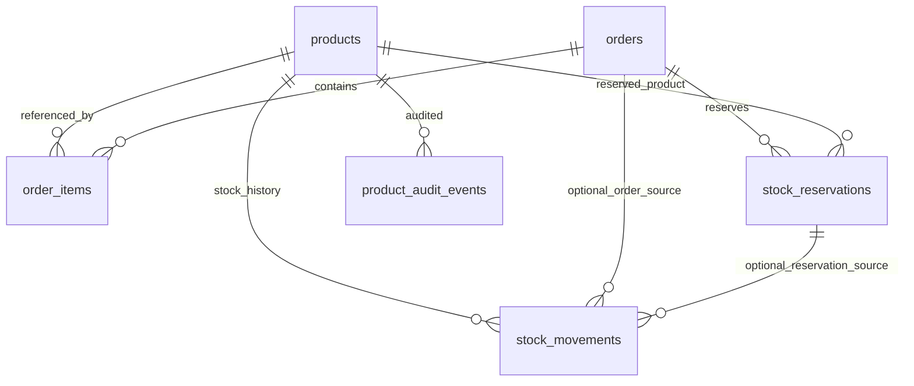

# 03 - Modelo de Dominio y Base de Datos

Este documento describe las entidades vigentes del e-commerce Orbynex Digital en Supabase/PostgreSQL.

## Entidades Principales

### `public.products`

Catalogo de productos y servicios.

Campos relevantes:

- `id`: UUID primario.
- `name`, `slug`, `short_description`, `description`.
- `meta_title`, `meta_description`, `seo_noindex`, `og_image_url`.
- `price`, `currency`.
- `category`.
- `image_url`, `image_url_thumb`, `image_url_card`, `image_url_detail`.
- `is_active`.
- `availability`.
- `stock_quantity`.
- `track_inventory`.
- `allow_backorder`.
- `low_stock_threshold`.
- `out_of_stock_behavior`.
- `payment_url`, `payment_button_label`.
- `display_order`.
- `created_at`, `updated_at`.

Reglas:

- El catalogo publico solo debe leer productos activos y vendibles.
- El admin puede leer, crear, editar y eliminar productos si tiene rol `admin`.
- `updated_at` se usa como guardia anti-sobrescritura en el editor admin.

### `public.user_roles`

Define roles de usuarios autenticados.

Campos:

- `id`
- `user_id`
- `role`: `admin` o `user`
- `created_at`

Reglas:

- Un usuario autenticado solo puede leer sus propios roles.
- Las politicas admin revisan `user_roles` directamente.
- La vista `/admin/users` cruza estos roles con usuarios Auth listados server-side para distinguir
  clientes y administradores sin exponer metadata cruda ni llaves privilegiadas.

### `auth.users`

Tabla administrada por Supabase Auth. No se consulta desde el cliente.

Campos usados en vistas admin:

- `id`
- `email`
- `created_at`
- `last_sign_in_at`
- `email_confirmed_at` / `confirmed_at`

Reglas:

- La API `api/admin/users.ts` lista usuarios con `auth.admin.listUsers()` solo en servidor.
- El endpoint valida primero el JWT con `auth.getUser(jwt)` y luego confirma rol `admin` en
  `public.user_roles`.
- No se expone `raw_user_meta_data` ni `raw_app_meta_data`; el nombre visible se infiere desde la
  ultima orden asociada cuando existe.

### `public.orders`

Orden maestra de compra Flow.

Estados relevantes:

- `pending`
- `stock_reserved`
- `redirected`
- `paid`
- `failed`
- `cancelled`
- `expired`
- `reservation_expired`
- `stock_conflict`
- `requires_manual_review`

Reglas:

- Clientes no escriben directamente en `orders`.
- La API/RPC crea ordenes y confirma pagos.
- Usuarios autenticados pueden leer sus propias ordenes.
- Admin puede leer todas las ordenes.
- La vista cliente `/cuenta` muestra solo pedidos asociados al usuario autenticado.
- La vista admin `/admin/orders` muestra pedidos globales en modo solo lectura, bajo la misma RLS admin.
- La vista admin `/admin/users` agrega metricas por usuario desde pedidos vinculados por `user_id`
  o por `customer_email` exacto para compras invitadas asociables.
- `redirected` representa "Pago iniciado" y es transitorio. La vista de usuarios lo marca como
  antiguo si supera una ventana de gracia de 30 minutos sin `paid_at` ni `failed_at`; no cambia
  estados historicos automaticamente.

### `public.order_items`

Items historicos de cada orden.

Reglas:

- Guarda precio y cantidad al momento de crear la orden.
- Clientes no escriben directamente.
- Usuarios autenticados pueden leer items de sus propias ordenes.
- Admin puede leer todos los items.
- `/admin/orders` reutiliza estos items para detalle operativo sin permitir cambios de estado ni edicion.

### `public.stock_reservations`

Reservas temporales de stock durante checkout.

Estados:

- `active`
- `confirmed`
- `released`
- `expired`

Reglas:

- No tiene acceso publico directo.
- La API/RPC gestiona reservas y liberaciones.

### `public.product_audit_events`

Historial de cambios importantes de productos.

Campos:

- `id`
- `product_id`
- `event_type`
- `before_snapshot`
- `after_snapshot`
- `changed_fields`
- `created_by`
- `created_at`

Eventos usados:

- `product_create`
- `product_update`
- `stock_adjustment`

Reglas:

- Solo admins pueden leer e insertar eventos.
- Se usa en `/admin/audit`.

### `public.stock_movements`

Historial de movimientos de stock.

Campos:

- `id`
- `product_id`
- `movement_type`
- `quantity_delta`
- `stock_before`
- `stock_after`
- `reason`
- `source`
- `order_id`
- `reservation_id`
- `created_by`
- `created_at`

Tipos previstos:

- `manual_adjustment`
- `manual_return`
- `manual_correction`
- `flow_sale`
- `reservation_created`
- `reservation_released`

Estado actual:

- Implementado para ajustes manuales admin.
- Flow y reservas todavia no escriben automaticamente movimientos.

## Relaciones

## Storage

Bucket:

- `product-images`

Convencion:

- `products/YYYY/MM/UUID-thumb.webp`
- `products/YYYY/MM/UUID-card.webp`
- `products/YYYY/MM/UUID-detail.webp`

Solo admins pueden escribir imagenes.
