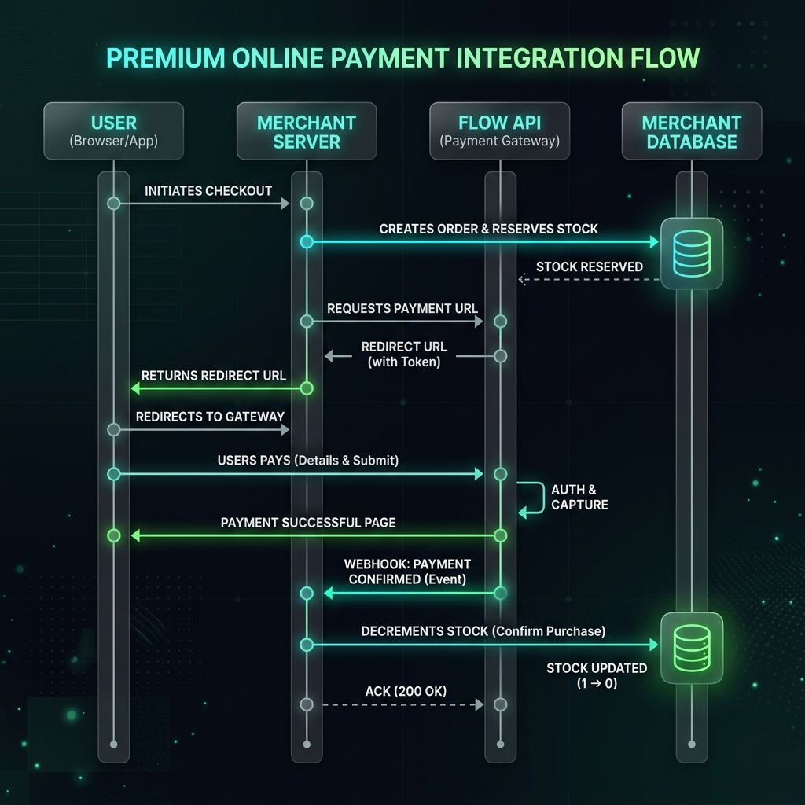
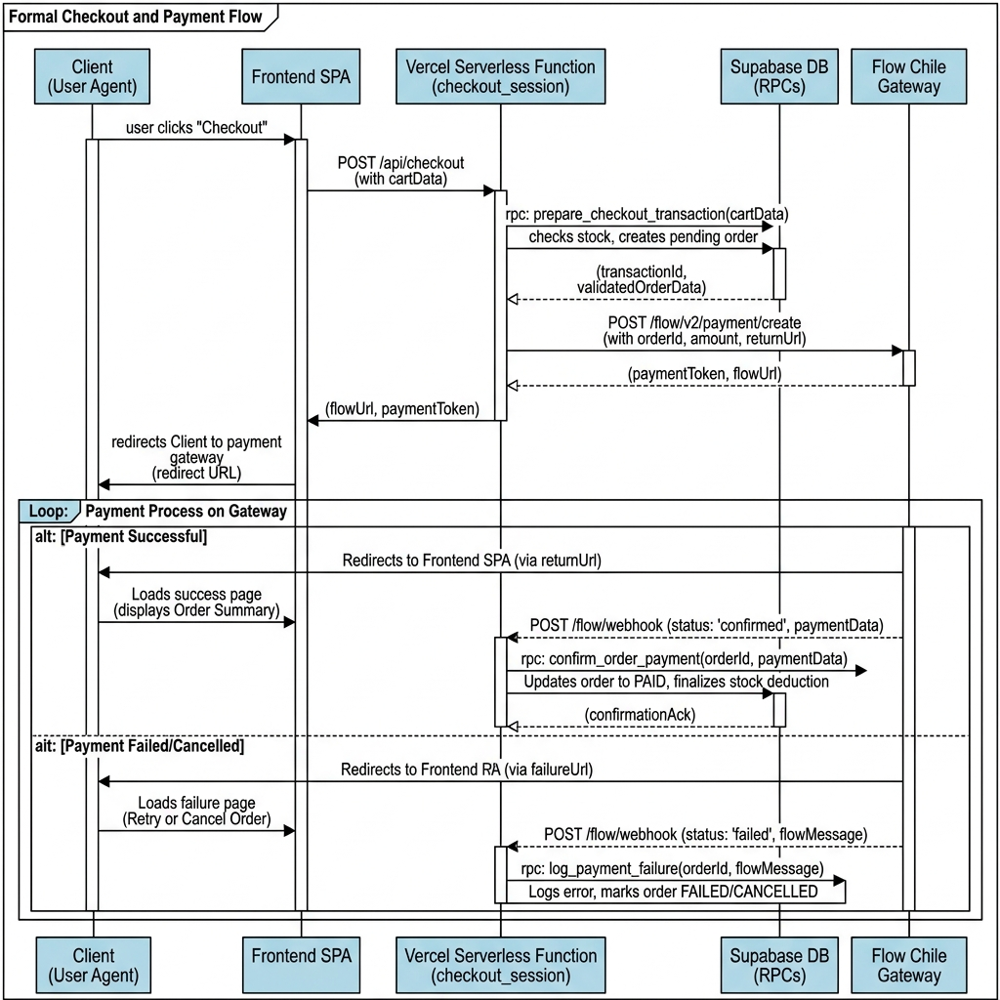
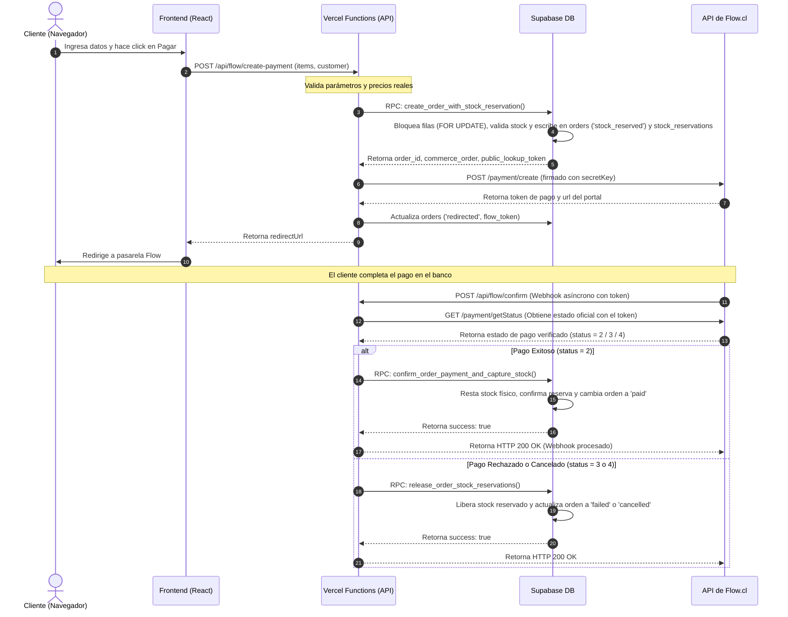

# 05 - Integración y Flujo de Pagos Flow.cl

Este documento detalla el flujo transaccional con la pasarela de pagos Flow.cl, la arquitectura de sus endpoints de backend, las reglas de confirmación segura, y los mecanismos de protección contra fallos concurrentes e inyección de datos.

---

## 1. Diagrama de Secuencia Transaccional

El siguiente diagrama detalla la interacción de los componentes durante el ciclo de vida del cobro y captura de stock:

#### Opción A: Vista Premium Conceptual

#### Opción B: Vista UML Formal de Secuencia

### Secuencia del Proceso de Pago (Mermaid)

---

## 2. Endpoints de la API Serverless

### 2.1. Crear Pago (`api/flow/create-payment.ts`)
*   **Método**: `POST`
*   **Función**: Inicializa la orden localmente y en la pasarela.
*   **Detalles del Flujo**:
    1.  Agrupa los ítems del carrito y consulta el precio real y stock en Supabase.
    2.  Ejecuta la RPC `create_order_with_stock_reservation()`, la cual valida la disponibilidad del stock físico. Si hay stock, inserta la orden en estado `stock_reserved` e inicia una reserva activa de stock por 10 minutos.
    3.  Llama a la API de Flow para generar la transacción.
    4.  Si la llamada a Flow falla, ejecuta de inmediato la RPC `release_order_stock_reservations` para liberar el stock reservado y cambia el estado de la orden a `failed`.
    5.  Si tiene éxito, actualiza la orden local con el `flow_token` y responde al frontend con la URL de redirección y el `public_lookup_token`.

### 2.2. Confirmar Pago Webhook (`api/flow/confirm.ts`)
*   **Método**: `POST` (ejecutado por Flow) o `GET` (cuando el cliente retorna y se forza actualización).
*   **Función**: Webhook transaccional definitivo que procesa los cobros y descuenta inventario físico.
*   **Seguridad Obligatoria**:
    *   **Validación de Montos y Monedas**: El script obtiene los datos oficiales desde Flow y los compara de forma estricta contra la orden en la base de datos local para verificar correspondencia de `commerceOrder`, `currency` y `amount` total, previniendo ataques de inyección o suplantación de pagos.
    *   **Consulta Directa Obligatoria**: No se confía en los parámetros enviados en el cuerpo del request. El backend ejecuta siempre una consulta GET directa a Flow utilizando el token para obtener el estado verificado directamente desde los servidores de la pasarela.

### 2.3. Estado de Orden (`api/flow/order-status.ts`)
*   **Método**: `GET`
*   **Función**: Permite al cliente en el frontend consultar de forma segura el estado de una orden.
*   **Seguridad**: Requiere obligatoriamente pasar por query string los parámetros de control `commerceOrder` y `publicLookupToken`. Esto previene el scraping o visualización de pedidos ajenos al evitar el uso de identificadores incrementales en el cliente.

---

## 3. Idempotencia y Manejo de Estados Duplicados

El endpoint de confirmación (`api/flow/confirm.ts`) implementa una política estricta de idempotencia para tolerar múltiples llamadas repetidas del webhook de Flow o recargas del cliente sin duplicar cobros ni realizar decrementos incorrectos de stock:

*   **Verificación de Estado Terminal**: Si la orden ya se encuentra en estado `paid`, el endpoint responde inmediatamente `idempotent: true` con código HTTP 200 sin ejecutar ninguna consulta a base de datos.
*   **Estados Terminales Operacionales**: Si la orden posee un estado terminal operacional (`reservation_expired`, `stock_conflict`, `requires_manual_review`) y el nuevo estado recibido por Flow no es exitoso (`paid`), se descarta la confirmación y se responde éxito para evitar inconsistencias de stock.

---

## 4. Reglas del Frontend: Qué NUNCA Debe Hacer el Cliente

El desarrollo del frontend debe respetar estrictamente los siguientes principios de seguridad:

1.  **NUNCA iniciar pagos directamente desde el cliente**: El frontend no debe comunicarse con la API de Flow de forma directa ni exponer llaves privadas en el código fuente.
2.  **NUNCA calcular montos de órdenes en el navegador**: Las cantidades en el carrito se envían limpias al backend. El backend calcula los subtotales oficiales usando el precio unitario registrado en la base de datos en ese instante.
3.  **NUNCA actualizar el stock físico directamente**: El frontend no tiene permisos para insertar o modificar registros en las tablas de inventario físico o reservas. Toda actualización de stock es una consecuencia exclusiva de las funciones SQL RPC ejecutadas server-side mediante el uso seguro de la `service_role_key`.
