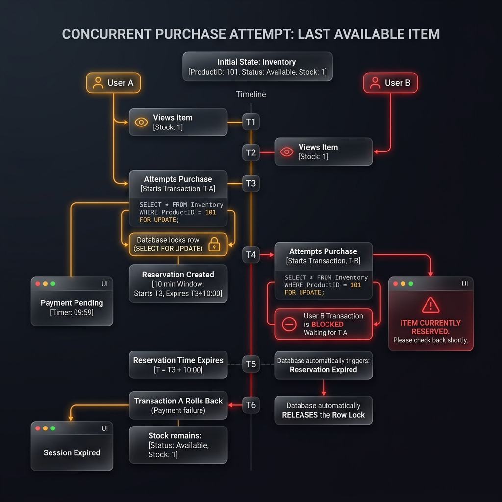
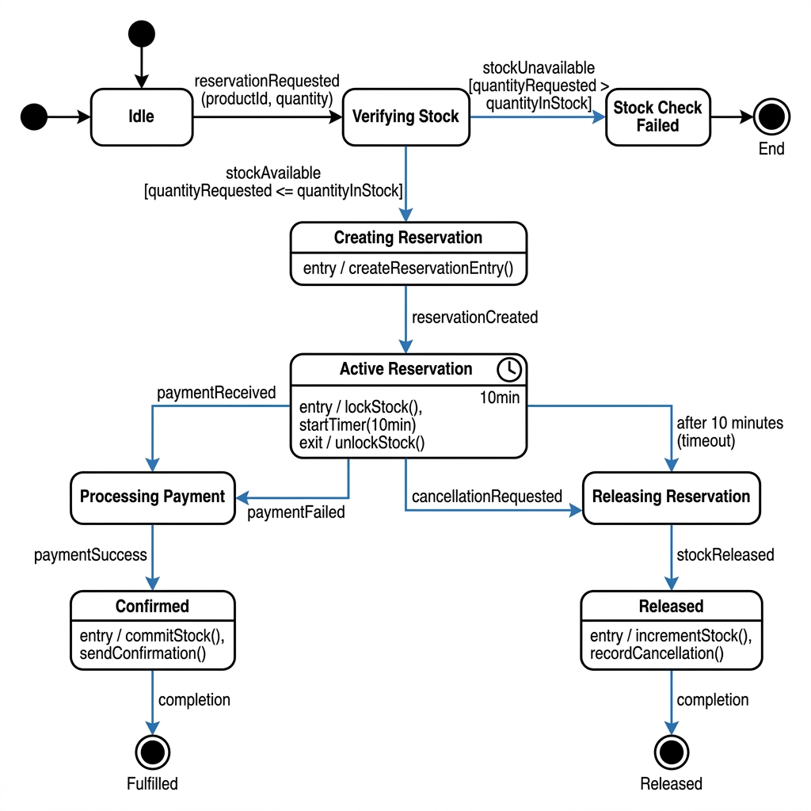
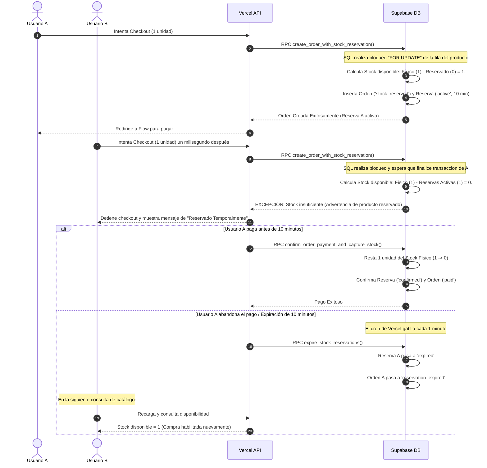
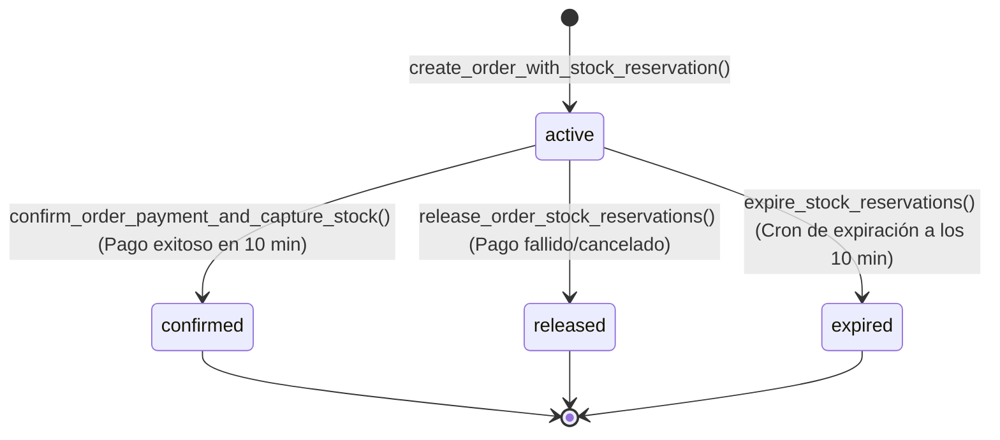

# 06 - Gestión de Inventario y Reservas de Stock

Este documento detalla el diseño de inventario de la plataforma, explicando la diferencia entre stock físico y stock vendible, el funcionamiento de la ventana de reserva de 10 minutos, y la mitigación técnica contra condiciones de carrera concurrentes.

---

## 1. Concepto Fundamental de Inventario

El sistema opera bajo un modelo de inventario dinámico de doble nivel para proteger la integridad del catálogo y evitar ventas duplicadas (over-selling):

*   **Stock Físico (`stock_quantity` en la tabla `products`)**: Inventario real de bodega. Sólo disminuye definitivamente cuando una orden de compra pasa al estado `paid`.
*   **Reservas Activas (Suma de registros con `status = 'active'` en la tabla `stock_reservations`)**: Unidades bloqueadas transitoriamente por usuarios que se encuentran en el proceso de pago.
*   **Stock Vendible (Cálculo Dinámico)**: Cantidad real disponible en catálogo para nuevos clientes.
    $$\text{Stock Vendible} = \max(0, \text{Stock Físico} - \text{Reservas Activas})$$

---

## 2. Diagrama de Reserva y Concurrencia de Stock

El siguiente diagrama detalla cómo se gestionan las reservas cuando dos usuarios compiten por adquirir la última unidad en stock de un producto:

#### Opción A: Vista Premium Conceptual


#### Opción B: Vista UML Formal de Estados de Reserva



### Flujo de Concurrencia e Inventario (Mermaid)



---

## 3. Estados de la Reserva

El ciclo de vida de un registro en `stock_reservations` transiciona a través de los siguientes estados:



---

## 4. Mitigación contra Condiciones de Carrera (Race Conditions)

En sistemas de alta concurrencia, dos transacciones pueden leer el stock disponible simultáneamente antes de escribir su reserva, aprobando ambas operaciones incorrectamente. Orbynex mitiga este riesgo mediante **bloqueos atómicos a nivel de fila en base de datos**:

1.  **Bloqueo Preventivo (`FOR UPDATE`)**: La función RPC `create_order_with_stock_reservation` inicia un bloqueo exclusivo de la fila del producto en la tabla `products` antes de sumar las reservas activas:
    ```sql
    FOR v_product IN
      SELECT p.id FROM public.products p WHERE id = ANY(...) ORDER BY id FOR UPDATE OF p
    LOOP
      NULL;
    END LOOP;
    ```
2.  **Espera de Bloqueo**: Si un segundo checkout intenta acceder al mismo producto, su hilo SQL es forzado a esperar en cola de forma segura hasta que la primera transacción complete su reserva e inserte el registro.
3.  **Ordenamiento por ID**: Para evitar interbloqueos (deadlocks) cuando una orden contiene múltiples productos, las filas son ordenadas ascendentemente por su ID UUID (`ORDER BY p.id`) antes de adquirir el bloqueo.
