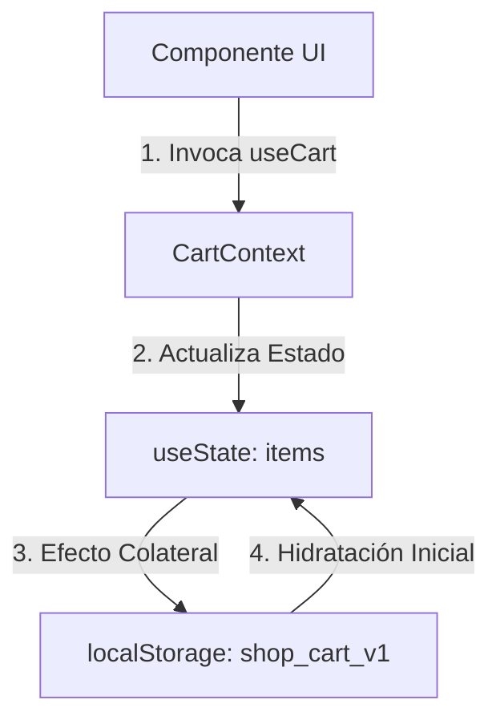

# 09 - Componentes del Frontend y Flujo de Interfaz

Este documento describe la arquitectura del cliente frontend construido con React, TanStack Start/Router y Tailwind CSS, detallando la lógica de componentes clave, la gestión de estado local y las pautas para extender la UI.

---

## 1. Rutas de la Aplicación (TanStack Router)

Las vistas están organizadas como rutas basadas en archivos bajo el directorio `/src/routes`:

*   `__root.tsx`: Layout base que define la estructura global del sitio, inyecta el `CartProvider` e inicializa el contenedor global de alertas (`sonner` y `Toaster`).
*   `index.tsx`: Página de inicio. Renderiza la propuesta de valor de la marca, los beneficios clave de automatización, y el bloque destacado de productos.
*   `catalogo.tsx`: Catálogo completo de servicios y productos, organizados con filtros por categoría y orden.
*   `producto.$slug.tsx`: Ficha técnica extendida de un producto. Carga los detalles y maneja los controles de inventario (compra directa, agregar al carrito, etiqueta de agotado o mensaje de reserva temporal).
*   `carrito.tsx`: Vista detallada del carrito con el listado de ítems seleccionados, desglose de costos y validación dinámica de disponibilidad.
*   `checkout.tsx`: Formulario de datos del cliente e inicio del túnel de pagos de Flow.cl.
*   `checkout_.resultado.tsx`: Vista de aterrizaje que recibe los parámetros seguros de la pasarela y consulta a la API el estado final de la compra, mostrando el resultado de forma interactiva y limpiando el carrito local si corresponde.
*   `_authenticated/admin.index.tsx`: Listado administrativo para creación, edición, borrado y activación rápida de productos.

---

## 2. Componentes Clave de la Interfaz

### 2.1. Product Card (`src/components/product/ProductCard.tsx`)
*   **Función**: Renderiza la información básica del producto (nombre, descripción corta, precio, botón de acción).
*   **Lógica de Inventario**: Lee las propiedades actualizadas de disponibilidad de la API para inhabilitar el botón si está agotado o mostrar la advertencia si el stock físico está comprometido en reservas temporales.
*   **Enlaces Externos**: Si el producto posee un link de cobro personalizado (`payment_url`), el botón de acción redirige a dicho link omitiendo el carrito interno.

### 2.2. Product Image (`src/components/product/ProductImage.tsx`)
*   **Función**: Renderizado responsivo de imágenes de catálogo utilizando las variantes WebP generadas.
*   **Estrategia**: Carga la variante miniatura (`image_url_thumb`), tarjeta (`image_url_card`), o detalle (`image_url_detail`) según el contexto de pantalla y el componente contenedor para optimizar el consumo de recursos de red del cliente.

### 2.3. Cart Drawer (`src/components/cart/CartDrawer.tsx`)
*   **Función**: Panel lateral de acceso rápido para ver y gestionar ítems en el carrito.
*   **Lógica**: Se sincroniza directamente con el store global, permitiendo aumentar o disminuir cantidades e iniciando la validación previa de stock antes de pasar al checkout.

### 2.4. Admin Product Form (`src/components/admin/ProductForm.tsx`)
*   **Función**: Formulario completo para la creación o modificación de un producto en el panel de administración.
*   **Integración de Optimización**: Contiene el handler de subida de imágenes que invoca a `optimizeProductImageVariants` de `storage.service.ts`, transformando el archivo seleccionado en tres variantes WebP antes de subirlas a Supabase.

### 2.5. Related Products (`src/components/product/RelatedProducts.tsx`)

* **Funcion**: Renderiza recomendaciones en cada ficha mediante las tarjetas publicas existentes.
* **Seleccion**: Prioriza la misma categoria, excluye el producto actual y completa los espacios con otras categorias.
* **Estado vacio**: Si la tienda solo tiene el producto actual, la seccion no se renderiza.
* **Rendimiento**: Usa consultas limitadas, cache de React Query, imagenes `card` diferidas y disponibilidad publica aplicada una sola vez.
* **Responsive**: Grilla de tres columnas en escritorio y scroll horizontal nativo con `scroll-snap` en movil.
* **Configuracion**: Limites, textos, tiempos de cache y fallback se controlan desde `commerceConfig.relatedProducts`.

---

## 3. Estado Global del Carrito (`cart.store.tsx`)

El estado del carrito es expuesto a través de un React Context (`CartProvider`) y el hook personalizado `useCart()`:

*   **Persistencia**: El store se hidrata inicialmente leyendo de `localStorage` (`shop_cart_v1`) y guarda de forma reactiva cada modificación a través de un `useEffect` aislado.
*   **Operaciones expuestas**:
    *   `addItem(product, quantity)`: Añade un producto verificando previamente si cumple con la restricción `canPurchase()`.
    *   `updateQuantity(productId, quantity)`: Modifica unidades de un ítem existente o lo elimina si la cantidad llega a 0.
    *   `clear()`: Limpia por completo la lista de compras al concretar un pago exitoso.

---

## 4. Pautas para Extender el Frontend sin Tocar el Backend

Si necesitas agregar nuevas características visuales al e-commerce, sigue estas directrices para evitar romper la lógica existente:

1.  **Mantén el flujo de disponibilidad en caliente**: Si agregas un nuevo carrusel de productos destacados o secciones de catálogo cruzadas en el frontend, pasa siempre la lista de productos por la función `applyPublicAvailability()` de `products.service.ts` antes de renderizarlos. Esto asegura que muestren el stock y los mensajes de reserva temporales en tiempo real.
2.  **No elimines el fallback de enlaces de pago**: Conserva siempre el campo `payment_url` y el soporte para botones de pago directo en las fichas de productos. Esto permite la venta directa omitiendo el carrito transaccional cuando la pasarela Flow no esté configurada o para productos específicos de alta prioridad.
3.  **Usa componentes Radix para modales y menús**: El proyecto utiliza Radix UI sin estilos predeterminados. Si necesitas crear nuevos modales de confirmación, menús desplegables o elementos flotantes, extiéndelos a partir de los componentes base definidos en `/src/components/ui/` para mantener la accesibilidad y el diseño consistentes.
